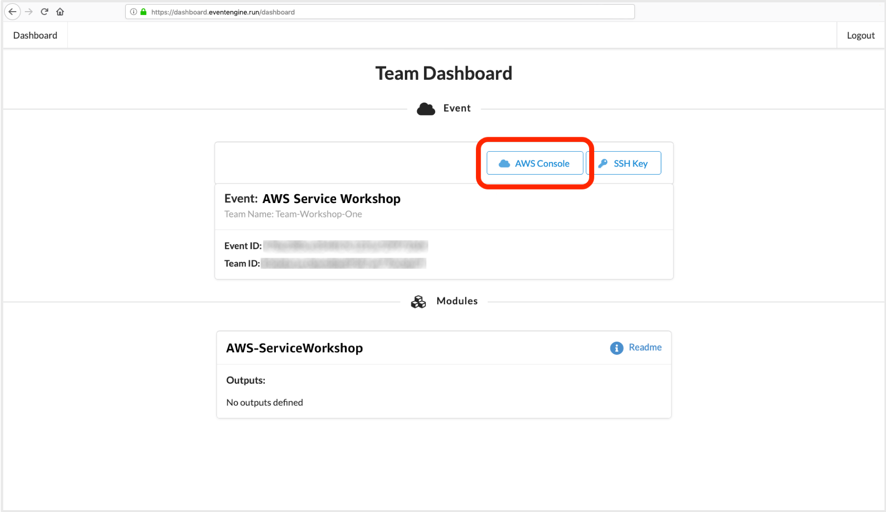

# Event engine access

웹 브라우저를 열고 Event Engine 로그인 페이지로 이동합니다. [https://dashboard.eventengine.run ](https://dashboard.eventengine.run/). 이용약관 로그인 페이지가 표시됩니다. Event Engine 계정 사용에 적용되는 이용 약관을 읽고 이해하십시오.

이벤트 직원이 12자리 팀 해시를 제공합니다. 12자리 해시를 사용하여 로그인합니다.

\
추가 로그인 단계를 묻는 메시지가 표시됩니다. 이메일을 사용하여 일회용 비밀번호(OTP)를 생성합니다. 아래 스크린샷을 참조하세요.

.png>)

로그인하면 팀 대시보드로 리디렉션됩니다. 클릭 `Set Team Name`하고 이메일 주소를 입력합니다(이벤트 등록에 사용한 이메일 주소가 바람직하지만 반드시 그럴 필요는 없음).

\
팀 대시보드에서 AWS 콘솔 링크를 클릭합니다.

\
버튼을 클릭 `Open AWS Console`하여 AWS 콘솔을 엽니다.

\
이제 Event Engine에서 판매하는 이 임시 AWS 계정으로 인증할 수 있으므로 다음 단계로 진행하여 Cloud9 IDE에 액세스하십시오.

\
