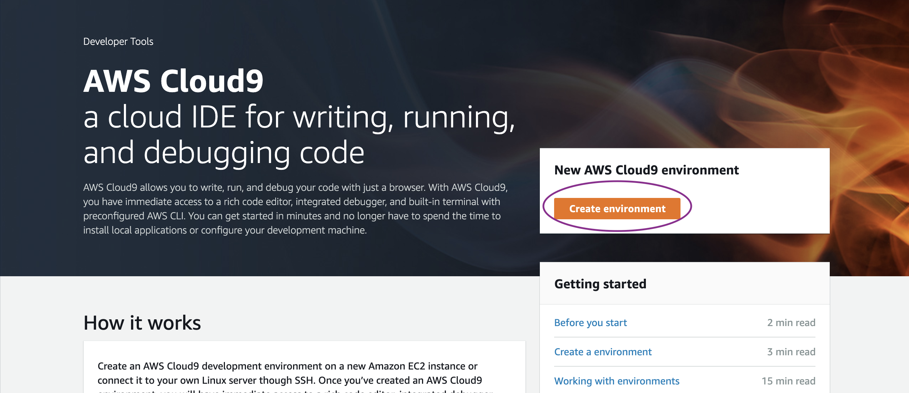

# Prerequisites

### 1. 서버리스 인프라 구축

\
서버리스 인프라를 배포하려면 다음과 같은 고급 단계를 완료하십시오.&#x20;

1\. Cloud9 IDE 환경을 만듭니다.&#x20;

2\. 서버리스 인프라를 배포하기 위해 CloudFormation 템플릿을 실행합니다.&#x20;

3\. 생성된 DynamoDB 테이블에 데이터를 채운다.


### 2.패키지 준비 및 다운로드&#x20;


본 워크샵에는 us-east-1 혹 us-west-2 리전을 사용하는 것을 추천드립니다.


워크샵을 운영하기 위해 다음 단계를 수행하십시오.

#### Linux Shell 터미널에 대한 엑세스&#x20;

이 예에서는 [AWS 명령줄 인터페이스 를 사용합니다. ](http://docs.aws.amazon.com/cli/latest/userguide/cli-chap-welcome.html)로컬 컴퓨터의 터미널/셸 응용 프로그램에서 실행됩니다.

AWS Cloud9 서비스를 사용하여 AWS CLI 패키지, git 및 기타 여러 유용한 유틸리티가 내장된 IDE 기능과 함께 사전 설치된 환경을 설정하는 것이 좋습니다. 로그인하면 이 브라우저 기반 IDE를 코딩에 사용하고 bash 셸을 사용하여 Linux 명령을 실행할 수 있습니다. Cloud9 환경을 생성하는 동안 최대 절전 모드 설정이 30분 이상으로 구성되어 있는지 확인하십시오.

1. [Cloud9](https://us-east-2.console.aws.amazon.com/cloud9/home/product) 으로 이동
2. **환경 만들기** 선택



&#x20;3\. 이름을 **devops-workshop 으로 지정하고 다음** 을 클릭 합니다.&#x20;

&#x20;4\. 인스턴스 유형으로 **"t3.small"** 을 선택하고 모든 기본값을 사용하고 **환경 생성 을 클릭합니다.**


#### Cloud9 EC2에 연결할 IAM 역할 생성&#x20;

Cloud9에서 사용할 자격 증명을 구성하려면 아래 설명된 단계를 따르십시오.

관리자 권한으로 IAM 역할(devops-workshop-admin)을 생성하도록 합니다.

1. [이 링크를](https://console.aws.amazon.com/iam/home#/roles$new?step=review\&commonUseCase=EC2%2BEC2\&selectedUseCase=EC2\&policies=arn:aws:iam::aws:policy%2FAdministratorAccess) 따라 관리자 액세스 권한이 있는 IAM 역할을 생성하십시오.[ ](https://console.aws.amazon.com/iam/home#/roles$new?step=review\&commonUseCase=EC2%2BEC2\&selectedUseCase=EC2\&policies=arn:aws:iam::aws:policy%2FAdministratorAccess).
2. **AWS 서비스** 및 **EC2** 가 선택 되었는지 확인하고 **다음** 을 클릭 하여 권한을 봅니다.
3. **AdministratorAccess** 가 선택 되었는지 확인하고 **다음: 태그** 를 클릭하여 태그 를 할당합니다.
4. 기본값을 사용하고 **다음: 검토** 를 클릭하여 검토합니다.
5. _이름에_ **devops-workshop-admin** 을 입력 하고 **역할 생성 을** 클릭 합니다.

**Cloud9 EC2 인스턴스에 IAM 역할 연결**

1. ****[이 링크를 따라 Cloud9 EC2 인스턴스를 찾으십시오](https://console.aws.amazon.com/ec2/v2/home?#Instances:tag:Name=aws-cloud9-devops-workshop;sort=desc:launchTime) .[ ](https://console.aws.amazon.com/ec2/v2/home?#Instances:tag:Name=aws-cloud9-devops-workshop;sort=desc:launchTime)
2. 인스턴스를 선택한 다음 작업 > 보안 >  인스턴스 설정 > IAM 역할 연결/교체를 선택합니다.
3. **IAM 역할** 드롭다운 에서 **devops-workshop-admin** 을 선택 **하고 적용 을 선택합니다.**


**Cloud9의 AWS 설정에 액세스하고 AWS 관리형 임시 자격 증명 비활성화**


Cloud9은 일반적으로 IAM 자격 증명을 동적으로 관리합니다.&#x20;


1. 작업 공간으로 돌아가서 오른쪽 상단 모서리에 있는 톱니바퀴 아이콘을 클릭하거나 새 탭을 열려면 클릭하고 **"기본 설정 열기" 를 선택하십시오.**
2. **AWS 설정** 선택
3. **AWS 관리형 임시 자격 증명** 끄기
4. 기본 설정 탭 닫기


임시 자격 증명이 없도 확인하기 위해 기존 자격 증명 파일도 제거합니다.

```
rm -vf ${HOME}/.aws/credentials
```

다음 필수 패키지로 jq(JSON Processor)과 requests library를 설치 및 확인합니다.

```bash
sudo yum install jq
```

다음 pip3로 requests  설치합니다.

```bash
export AWS_REGION=$(curl -s \
169.254.169.254/latest/dynamic/instance-identity/document | jq -r '.region')

sudo pip3 install requests
```

Region 정보 등을 환경변수와 프로파일에 저장해 둡니다.

```
echo "export AWS_REGION=${AWS_REGION}" | tee -a ~/.bash_profile
aws configure set default.region ${AWS_REGION}
aws configure --profile default list
```

임시 자격 증명이 아닌 **devops-workshop-admin 로 IAM 역할**로 전환된지 확인합니다. ****&#x20;

```
aws sts get-caller-identity --region $AWS_REGION
```

git 저장소를 복제하여 필요한 소스를 다운로드합니다.

```bash
git clone https://github.com/aws-samples/amazon-devopsguru-samples
cd amazon-devopsguru-samples/generate-devopsguru-insights/
```

### 3. 서버 없는 인프라를 배포하기 위한 CloudFormation 템플릿 시작

다음 명령을 사용하여 CloudFormation 템플릿을 실행하십시오.

```bash
aws cloudformation create-stack --stack-name myServerless-Stack \
--template-body file:///$PWD/cfn-shops-monitoroper-code.yaml \
--capabilities CAPABILITY_IAM CAPABILITY_NAMED_IAM
```

AWS CloudFormation 배포는 샘플 코드를 사용하여 API Gateway, DynamoDB 테이블 및 Lambda 함수를 생성합니다.&#x20;

아래 명령어로 Stack 완료되었는지 확인하고  AWS CloudFormation 콘솔에 있는 스택의 Outputs 탭으로 이동합니다.&#x20;

```bash
aws cloudformation describe-stacks --stack-name myServerless-Stack --query Stacks[0].StackStatus
```

하나는 테이블 내용을 나열하고, 다른 하나는 내용을 채우는 것입니다.


### **4**. DynamoDB 테이블 구성

DynamoDB 테이블을 채우려면 다음 명령 (간단히 복사 붙여 넣기)을 실행하십시오. 아래 세 가지 명령은 CloudFormation 스택에서 DynamoDB 테이블의 이름을 식별하고 populate-shops-dynamodb-table.json 파일에 이름을 채 웁니다.

```bash
dynamoDBTableName=$(aws cloudformation list-stack-resources \
--stack-name myServerless-Stack | \
jq '.StackResourceSummaries[]|select(.ResourceType == "AWS::DynamoDB::Table").PhysicalResourceId' | tr -d '"')
```

populate-shops-dynamodb-table.json파일내에 "\<YOUR-DYNAMODB-TABLE-NAME>"를 DynamoDB 테이블명으로 replace하기 위해 아래 코드를 실행합니다.

```bash
sudo sed -i s/"<YOUR-DYNAMODB-TABLE-NAME>"/$dynamoDBTableName/g \
populate-shops-dynamodb-table.json
```

```
aws dynamodb batch-write-item \
--request-items file://populate-shops-dynamodb-table.json
```

이 명령은 다음과 같은 출력을 제공합니다.

```bash
{
"UnprocessedItems": {}
}
```

DynamoDB 테이블과 항목을 확인합니다.


&#x20;이렇게 하면 DynamoDB 테이블에 몇 가지 샘플 레코드가 채워지며, CloudFormation 스택의 Outputs 탭에 게시된 ListRestApiEndpointMonitorOper API URL에 액세스하여 확인할 수 있습니다. 다음 스크린샷은 출력을 보여 줍니다.


그럼 다음은 DevOps Guru 활성화를 해보겠습니다.
