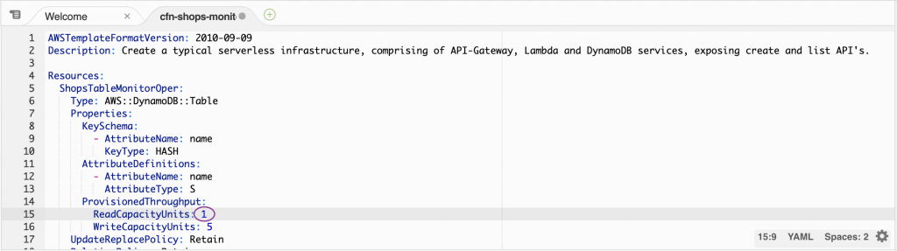

# Waiting for baselining of resources & Updating the CloudFormation Stack

DynamoDB 테이블 구성을 변경하고 작동 이벤트를 시뮬레이션하려면 다음 단계를 따르십시오.

DevOps Guru가 리소스의 베이스라인을 완료하고 일반적인 동작을 벤치마킹할 수 있도록 하기 위한 필수 단계입니다. 3 개의 리소스가있는 서버가없는 스택의 경우 다음 단계를 수행하기 전에 2 시간을 기다리는 것이 좋습니다. 프로덕션 환경에서 활성화되면 모니터링하기 위해 선택한 리소스 수에 따라 기준선을 완성하는 데 최대 24 시간이 걸릴 수 있습니다.

충분한 시간이 경과되면 구성을 변경하여 일반적인 작동 이벤트를 시뮬레이션합니다. 아래 그림과 같이 CloudFormation 템플릿을 업데이트하여 DynamoDB 테이블의 읽기 용량을 5에서 1로 변경합니다.

1. Cloud9 IDE의 왼쪽 상단에서 amazon-devopsguru-samples 디렉토리를 확장하여 디렉토리 구조를 볼 수 있으며, 다른 중첩 디렉토리(`generate-devopsguru-insights)`를 찾을 수 있습니다. 여기에서 CloudFormation 템플릿 파일 `cfn-shops-monitoroper-code.yaml`을 더블 클릭하여 엽니다.
2. `cfn-shops-monitoroper-code.yaml`Cloud9 IDE에서 연 후 15행으로 이동합니다 . `ReadCapacityUnits`아래와 같이 값을 5에서 1로 수정합니다 . 이렇게 하면 DynamoDB 테이블에서 [읽기 용량이 줄어듭니다. ](https://docs.aws.amazon.com/amazondynamodb/latest/developerguide/ProvisionedThroughput.html#ProvisionedThroughput.CapacityUnits.Read)



&#x20; 3\. 왼쪽 상단의 파일 메뉴로 이동하여 저장을 클릭합니다.


일반적인 실수는 yaml 파일 저장에 실패하는 것입니다. 다음 명령은 cloudformation(yaml 파일)이 저장되지 않은 경우 오류를 발생시킵니다. 아래 명령에서 오류가 발생하면 파일을 저장했는지 확인하십시오.


&#x20; 4\. Cloud9 터미널에서 다음 명령을 실행하여 업데이트된 CloudFormation 템플릿을 배포합니다.

```shell
cd ~/environment/amazon-devopsguru-samples/generate-devopsguru-insights
aws cloudformation update-stack --stack-name myServerless-Stack \
    --template-body file:///$PWD/cfn-shops-monitoroper-code.yaml \
    --capabilities CAPABILITY_IAM CAPABILITY_NAMED_IAM
```

&#x20; 5\. Cloud9 터미널에서 다음 명령어를 실행하여 CloudFormation 업데이트 상태를 확인합니다. 몇 분 후 명령이 반환 `UPDATE_COMPLETE`되면 다음 단계로 이동할 준비가 된 것입니다. 그렇지 않으면 이전 단계를 다시 실행하여 CFN이 변경되었는지 확인하십시오.

```properties
aws cloudformation describe-stacks --stack-name myServerless-Stack --query Stacks[0].StackStatus
```

&#x20; 6\. DynamoDB 테이블에서 ReadCapacityUnits 값이 5에서 1로 수정됬습니다.


