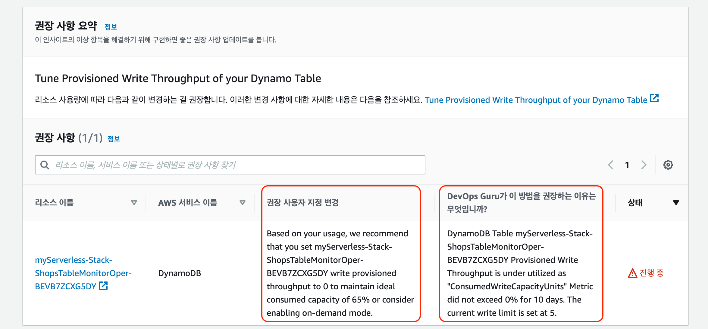

# 4. Review DevOps Guru Insights

&#x20;API 엔드포인트로 HTTP 요청을 계속 보내는 동안 DevOps Guru는 이상상태를 모니터링하고, 이상상태를 나타내는 지표에 대한 세부 정보를 제공하는 분석(Insights)을 기록하고, 이상상태를 완화하기 위해 실행 가능한 권장 사항을 인쇄합니다. 이 섹션에서는 이러한 통찰력 중 일부를 검토합니다.

&#x20;정상적인 조건에서 DevOps Guru 대시보드는 진행 중인 통찰력 카운터가 0으로 표시됩니다. 그것은 배후에서 많은 수의 메트릭을 모니터링하고 운영자가 카운터 또는 그래프를 수동으로 모니터링하는 부담을 덜어줍니다. 이상상태가 발생했을 때만 인사이트 형태로 경보를 발생시킨다.

&#x20;다음 스크린샷은 특정 CloudFormation 스택에 대한 지속적인 반응 통찰력을 보여줍니다. 시스템 상태 요약내 분석(Insights)을 선택하면 추가 세부 정보가 표시됩니다. **지난 시간에 분석된 총 리소스** 아래의 숫자 는 다를 수 있으므로 이 워크샵에서는 이 숫자를 무시해도 됩니다.

.png>)

리소스의 사용량에 따라 DynamoDB를 다음과 같이 변경하는 걸 권장하고 있습니다.

* 사용 상황에 따라 myServerless-Stack-ShopsTableMonitorOper-XXXXXXXXXXX 쓰기 프로비저닝 처리량을 0으로 설정하여 65% 이상적인 용량을 유지하거나 온디맨드 모드 활성화를 고려하는 것이 좋습니다.

DevOps Guru가 이 방법을 권장하는 이유는 무엇입니까?

* DynamoDB 테이블 myServerless-Stack-ShopsTableMonitorOper-XXXXXXXXXXX 프로비저닝된 쓰기 처리량은 'ConsumedWriteCapacityUnits' 메트릭이 10일 동안 0%를 초과하지 않았기 때문에 잘 활용되지 않았습니다. 현재 쓰기 제한은 5로 설정되어 있습니다.

**인사이트는 인사이트 개요**, **집계된 메트릭**, **관련 이벤트** 및 **권장 사항** 의 4개 섹션으로 나뉩니다. 이 섹션을 자세히 살펴보겠습니다.


DevOps Guru 통찰력에 대한 자세한 내용은 [문서 확인](https://docs.aws.amazon.com/devops-guru/latest/userguide/understanding-insights-console.html) 에서 확인합니다.

