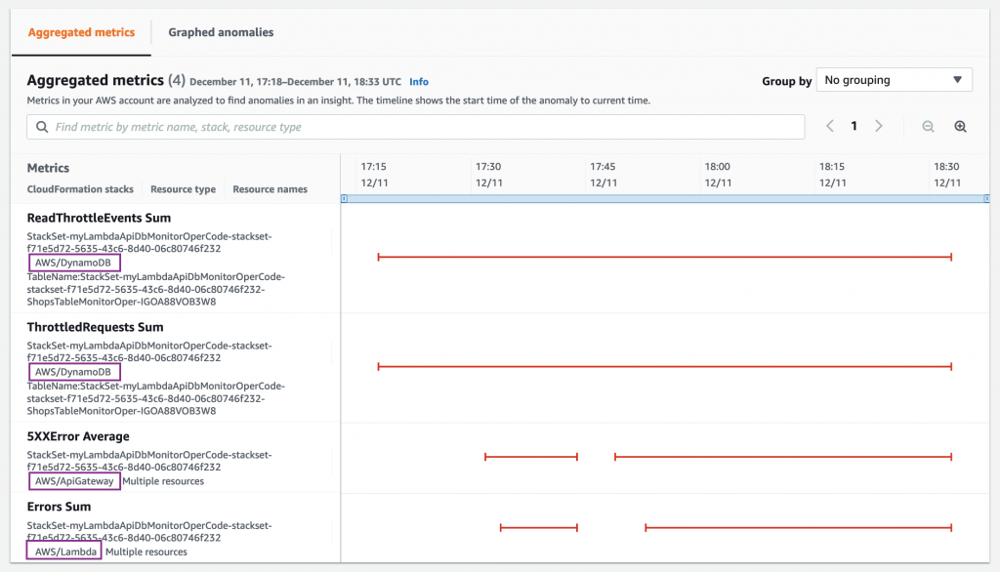

# Aggregated metrics

&#x20;다음 스크린샷은 **집계된 지표** 섹션을 보여줍니다. 여기에서 이상을 감지한 모든 리소스(DynamoDB, Lambda 및 API Gateway)에 대한 지표를 보여줍니다. 트래픽 패턴, Lambda 설정, 기준 트래픽에 따라 지표 목록이 다를 수 있습니다. 아래 예에서 타임라인은 DynamoDB의 이상이 먼저 시작되고 API Gateway 및 Lambda가 뒤따랐음을 보여줍니다. 이는 원인과 증상을 이해하고 올바른 이상 조사의 우선 순위를 정하는 데 도움이 됩니다.

* 예시1

* 예시2

* 예시3

&#x20;처음에는 두 개의 메트릭만 나열될 수 있지만 시간이 지남에 따라 이상을 나타내는 더 많은 메트릭이 채워집니다. DynamoDB의 이상 현상이 API Gateway 및 Lambda의 이상 현상보다 먼저 시작되어 사후 영향을 나타내는 것을 볼 수 있습니다. 이전 스크린샷의 정보 외에도 **Duration p90** 및 **IntegrationLatency p90** (각각 Lambda 및 API Gateway의 경우 증가된 백엔드 지연 시간으로 인해) 지표도 나열될 수 있습니다.


P90? 각 수치를 오름차순(적은 수치에서 높은 수치)로 정리하여 이들을 순서에 따라 동일한 규모로 나눈 후(10분위 기준) 나뉜 각 집단을 분위라 칭하는데, 예를 들어 각 분위를 P90/P10으로 표기했다면 9분위의 상한값과 1분의 상한값의 비율입니다. 10분위 기준으로 4분위의 상한값은 P40으로 표시하고, 5분위 기준 2분위도 P40으로 표시합니다. 백분위율로 측정할때 P90/P50비율을 많이 사용하는데 P50은 전체의 중위값을 의미합니다.&#x20;


\
