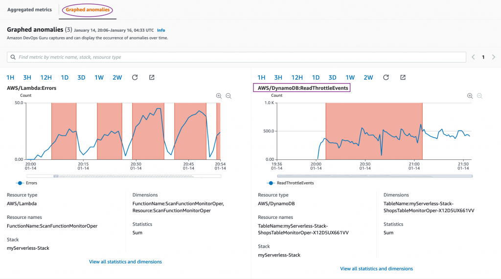

# Graphed anomalies

인사이트의 메트릭 섹션으로 돌아가서 **Graphed anomalies(그래프로 표시된 이상 항목)**를 선택 하면 모든 관련 리소스의 그래프가 표시됩니다. 아래 스크린샷은 DynamoDB ReadThrottleEvents 지표의 이상을 보여주는 스니펫을 보여줍니다. 그래프 패턴의 아래 스크린샷에서 볼 수 있듯이 테이블에 대한 읽기 작업이 프로비저닝된 읽기 용량 처리량을 초과하고 있습니다. 이것은 분명히 이상을 나타냅니다.

* 예시1

* 예시1

.png>)

&#x20;DynamoDB 테이블로 이동하여 [이 링크를](https://console.aws.amazon.com/dynamodb/home?#tables:) 테이블 구성을 확인합니다. 테이블 속성을 확인하면 읽기 용량이 1로 줄어든 것을 알 수 있습니다. 이것이 이 이상 현상을 초래한 근본 원인입니다.

이상 현상을 수정하려면 읽기 용량을 다시 5로 변경합니다.


인사이트가 활성화되어 있는 동안 시간이 지남에 따라 추가 이상을 감지하면 더 많은 메트릭이 채워지는 것을 볼 수 있습니다. 이전 테스트를 수행할 때 스크린샷에 나열된 모든 메트릭이 표시되지 않으면 더 기다려야 할 수 있습니다.


\
