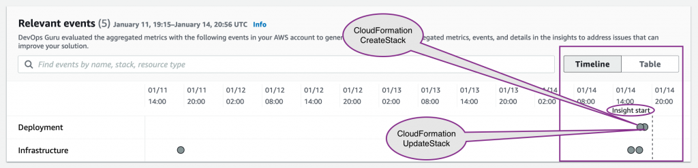
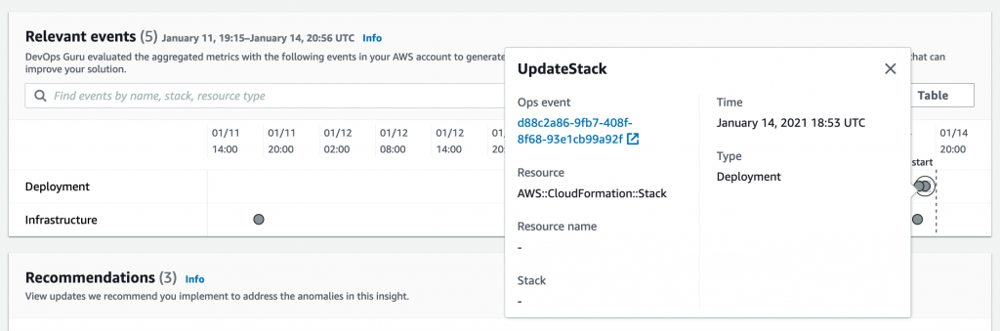

# Relevant events

이제 문제의 잠재적 트리거를 나열하는 관련 이벤트 섹션을 확인합니다. 여기에 나열된 이벤트는 이 리전의 이 CloudFormation 스택 리소스에서 수행된 작업 집합에 따라 다릅니다. 이렇게 하면 운영자가 이 문제를 일으켰을 수 있는 변경 사항을 쉽게 상기할 수 있습니다. 타임라인의 Insight 시작 부분 근처에 있는 점(이벤트를 나타냄)이 특히 중요합니다.

* 예시1

* 예시2

.png>)

이러한 이벤트를 자세히 살펴봐야 하는 경우 이러한 지점 중 하나를 클릭하기만 하면 아래 스크린샷과 같이 자세한 내용이 제공됩니다.

* 예시1

* 예시2

이벤트에 대한 링크를 선택하여 작동 이벤트에 대한 특정 세부 정보를 볼 수 있습니다(CloudFormation 업데이트 스택 작업을 통한 구성 변경).

\
\
